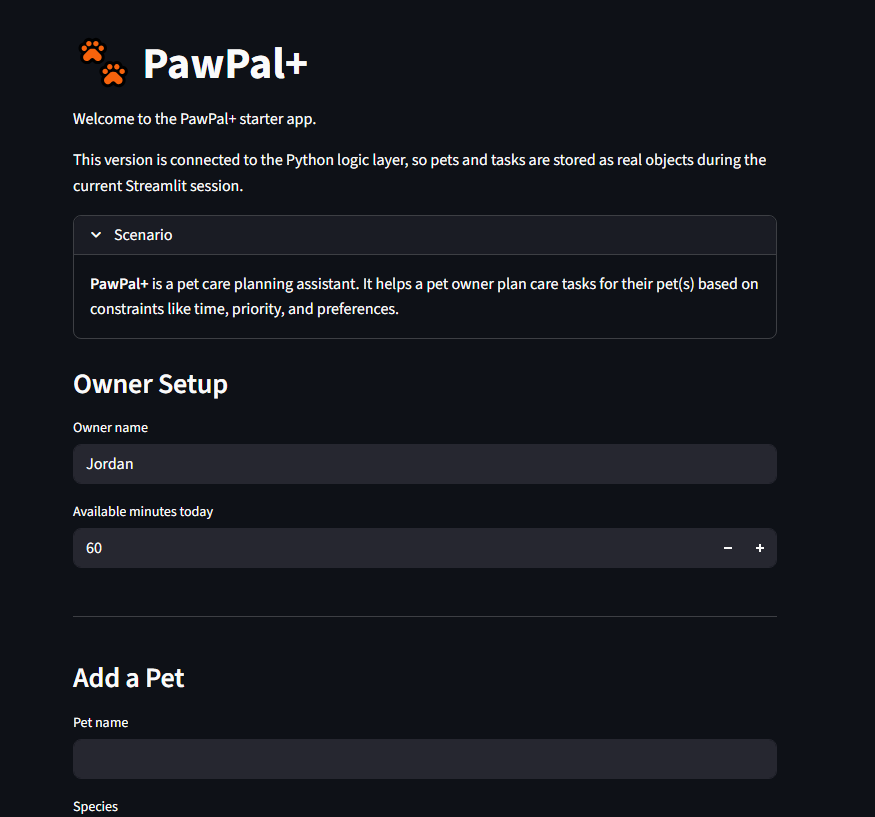

# PawPal+ (Module 2 Project)

You are building **PawPal+**, a Streamlit app that helps a pet owner plan care tasks for their pet.

## Scenario

A busy pet owner needs help staying consistent with pet care. They want an assistant that can:

- Track pet care tasks (walks, feeding, meds, enrichment, grooming, etc.)
- Consider constraints (time available, priority, owner preferences)
- Produce a daily plan and explain why it chose that plan

Your job is to design the system first (UML), then implement the logic in Python, then connect it to the Streamlit UI.

## What you will build

Your final app should:

- Let a user enter basic owner + pet info
- Let a user add/edit tasks (duration + priority at minimum)
- Generate a daily schedule/plan based on constraints and priorities
- Display the plan clearly (and ideally explain the reasoning)
- Include tests for the most important scheduling behaviors

## Features

- Add and manage multiple pets for one owner
- Create tasks with priority, frequency, category, and scheduled time
- Sort scheduled tasks by due date and time
- Filter tasks by pet and completion status
- Detect exact-time scheduling conflicts and show warnings in the UI
- Regenerate daily and weekly recurring tasks after completion
- Generate a daily plan that respects the owner's available minutes

## Getting started

### Setup

```bash
python -m venv .venv
source .venv/bin/activate  # Windows: .venv\Scripts\activate
pip install -r requirements.txt
```

### Suggested workflow

1. Read the scenario carefully and identify requirements and edge cases.
2. Draft a UML diagram (classes, attributes, methods, relationships).
3. Convert UML into Python class stubs (no logic yet).
4. Implement scheduling logic in small increments.
5. Add tests to verify key behaviors.
6. Connect your logic to the Streamlit UI in `app.py`.
7. Refine UML so it matches what you actually built.

## Smarter Scheduling

PawPal+ now includes a few lightweight scheduling features to make planning more useful:

- Tasks can be sorted by due date and `HH:MM` scheduled time.
- The scheduler can filter tasks by pet name or completion status.
- Daily and weekly recurring tasks automatically generate the next occurrence when completed.
- The scheduler can detect exact-time conflicts and return warning messages instead of crashing.

## 📸 Demo

Add your final Streamlit screenshot here after capturing it from the running app:



The final UML diagram is included in [uml_final.svg](./uml_final.svg).

## Testing PawPal+

Run the automated tests with:

```bash
python -m pytest
```

The test suite currently checks:

- Basic task completion and pet task addition behavior
- Chronological sorting of scheduled tasks
- Daily recurrence creating the next task instance
- Exact-time conflict detection
- The empty-schedule case when a pet has no tasks

Confidence Level: `4/5 stars`
