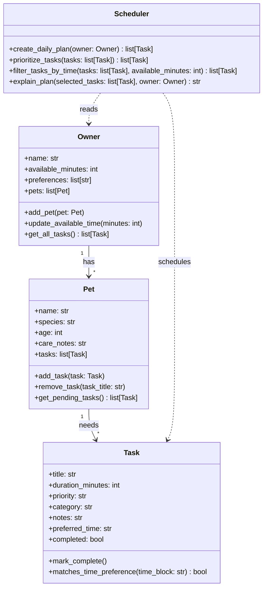

# PawPal+ Project Reflection

## 1. System Design

**a. Initial design**

- Three core user actions:
- A pet owner should be able to add and manage pets with basic details like name, species, age, and care notes.
- A pet owner should be able to create care tasks such as walks, feeding, medication, grooming, or enrichment with a duration and priority.
- A pet owner should be able to generate a daily plan that selects the most important tasks that fit the owner's available time and preferences.

- My initial UML design uses four main classes: `Owner`, `Pet`, `Task`, and `Scheduler`.
- `Owner` stores the human user's name, available time, preferences, and the pets they are responsible for. Its job is to manage pets and provide a combined view of all tasks that need to be considered.
- `Pet` stores information about an individual pet and the list of care tasks associated with that pet. Its responsibility is to organize pet-specific tasks.
- `Task` represents one unit of care work. It holds the task title, duration, priority, category, optional preferred time, and completion state.
- `Scheduler` is responsible for turning the owner's constraints and all pending tasks into a daily plan. It should prioritize tasks, filter them based on available time, and explain why tasks were selected.

- Mermaid draft:

**b. Design changes**

- I kept the first draft intentionally simple so the relationships stayed clear. One design choice I made while drafting the skeleton was to keep scheduling behavior inside a dedicated `Scheduler` class instead of mixing it into `Owner` or `Pet`.
- I also added `preferred_time` and `completed` to `Task` because those fields will make it easier to support scheduling decisions and track whether a task still needs to be included in the daily plan.

---

## 2. Scheduling Logic and Tradeoffs

**a. Constraints and priorities**

- What constraints does your scheduler consider (for example: time, priority, preferences)?
- How did you decide which constraints mattered most?

**b. Tradeoffs**

- One tradeoff in my scheduler is that conflict detection only checks for exact date-and-time matches instead of full overlapping durations. For example, it will warn if two tasks are both scheduled at `08:00`, but it will not yet detect that a task from `08:00-08:30` overlaps with one starting at `08:15`.
- That tradeoff is reasonable for this version because it keeps the logic lightweight, readable, and easy to verify while still catching the most obvious scheduling mistakes a pet owner might make.

---

## 3. AI Collaboration

**a. How you used AI**

- How did you use AI tools during this project (for example: design brainstorming, debugging, refactoring)?
- What kinds of prompts or questions were most helpful?

**b. Judgment and verification**

- Describe one moment where you did not accept an AI suggestion as-is.
- How did you evaluate or verify what the AI suggested?

---

## 4. Testing and Verification

**a. What you tested**

- What behaviors did you test?
- Why were these tests important?

**b. Confidence**

- How confident are you that your scheduler works correctly?
- What edge cases would you test next if you had more time?

---

## 5. Reflection

**a. What went well**

- What part of this project are you most satisfied with?

**b. What you would improve**

- If you had another iteration, what would you improve or redesign?

**c. Key takeaway**

- What is one important thing you learned about designing systems or working with AI on this project?
