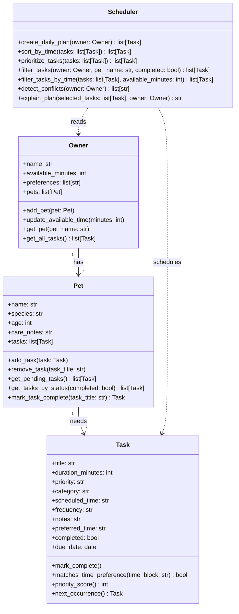

# PawPal+ Project Reflection

## 1. System Design

**a. Initial design**

- Three core user actions:
- A pet owner should be able to add and manage pets with basic details like name, species, age, and care notes.
- A pet owner should be able to create care tasks such as walks, feeding, medication, grooming, or enrichment with a duration and priority.
- A pet owner should be able to generate a daily plan that selects the most important tasks that fit the owner's available time and preferences.

- My initial UML design uses four main classes: `Owner`, `Pet`, `Task`, and `Scheduler`.
- `Owner` stores the human user's name, available time, preferences, and the pets they are responsible for. Its job is to manage pets and provide a combined view of all tasks that need to be considered.
- `Pet` stores information about an individual pet and the list of care tasks associated with that pet. Its responsibility is to organize pet-specific tasks.
- `Task` represents one unit of care work. It holds the task title, duration, priority, category, optional preferred time, and completion state.
- `Scheduler` is responsible for turning the owner's constraints and all pending tasks into a daily plan. It should prioritize tasks, filter them based on available time, and explain why tasks were selected.

- Final Mermaid diagram:

**b. Design changes**

- I kept the first draft intentionally simple so the relationships stayed clear. One design choice I made while drafting the skeleton was to keep scheduling behavior inside a dedicated `Scheduler` class instead of mixing it into `Owner` or `Pet`.
- I later expanded `Task` with `scheduled_time`, `frequency`, and `due_date` so the scheduler could sort tasks and support recurring care.
- I also added `mark_task_complete()` to `Pet` and `detect_conflicts()` to `Scheduler` because the final app needed a clear place to handle recurring task rollover and lightweight schedule warnings.

---

## 2. Scheduling Logic and Tradeoffs

**a. Constraints and priorities**

- My scheduler considers available minutes, task priority, due date, scheduled time, and task completion status. It also supports simple filtering by pet name so the owner can focus on one animal at a time.
- I treated time and priority as the most important constraints because the project scenario is about a busy owner who cannot do everything. That means the system should first choose tasks that matter most and then fit them into the amount of time the owner actually has.

**b. Tradeoffs**

- One tradeoff in my scheduler is that conflict detection only checks for exact date-and-time matches instead of full overlapping durations. For example, it will warn if two tasks are both scheduled at `08:00`, but it will not yet detect that a task from `08:00-08:30` overlaps with one starting at `08:15`.
- That tradeoff is reasonable for this version because it keeps the logic lightweight, readable, and easy to verify while still catching the most obvious scheduling mistakes a pet owner might make.

---

## 3. AI Collaboration

**a. How you used AI**

- I used AI for design brainstorming, turning UML ideas into class skeletons, suggesting small scheduling algorithms, and drafting starter tests. It was most helpful when I gave it a specific file and a focused question about one design problem at a time.
- The most effective prompts were concrete ones like "How should `Scheduler` retrieve all tasks from the owner's pets?" or "What edge cases matter for sorting and recurring tasks in this codebase?" Those prompts led to useful suggestions that I could quickly compare against my own design goals.

**b. Judgment and verification**

- One moment where I did not accept the broadest possible AI-style solution was conflict detection. A more advanced approach could calculate overlapping durations, but I kept a simpler exact-time warning system because it was easier to explain, test, and fit within the project scope.
- I verified AI suggestions by running the CLI demo, checking the Streamlit UI behavior, and using `pytest` to confirm that the code still passed the important behaviors I expected.

---

## 4. Testing and Verification

**a. What you tested**

- I tested task completion, adding a task to a pet, chronological sorting, recurring daily task generation, conflict detection, and the empty-schedule case.
- These tests were important because they cover the main pieces of system behavior that make the scheduler feel intelligent instead of just being a data container.

**b. Confidence**

- I am fairly confident that the scheduler works correctly for the main scenarios in this project because the CLI demo and automated tests both confirm the expected behavior. My confidence level is 4 out of 5.
- If I had more time, I would test overlapping durations, duplicate pet names, invalid time formats, and more UI-driven flows such as repeated button clicks in Streamlit session state.

---

## 5. Reflection

**a. What went well**

- I am most satisfied with the way the backend logic, CLI demo, tests, and Streamlit UI now all connect to the same scheduling model. That made the project feel like one coherent system instead of separate exercises.

**b. What you would improve**

- In another iteration, I would redesign the scheduler to account for overlapping task durations and allow users to mark tasks complete directly from the Streamlit interface. I would also improve validation around time input so the app is more robust for real users.

**c. Key takeaway**

- My biggest takeaway is that AI is most useful when I stay in the lead architect role. The best results came from breaking the project into phases, asking focused questions, and verifying each suggestion instead of accepting generated code as automatically correct.
